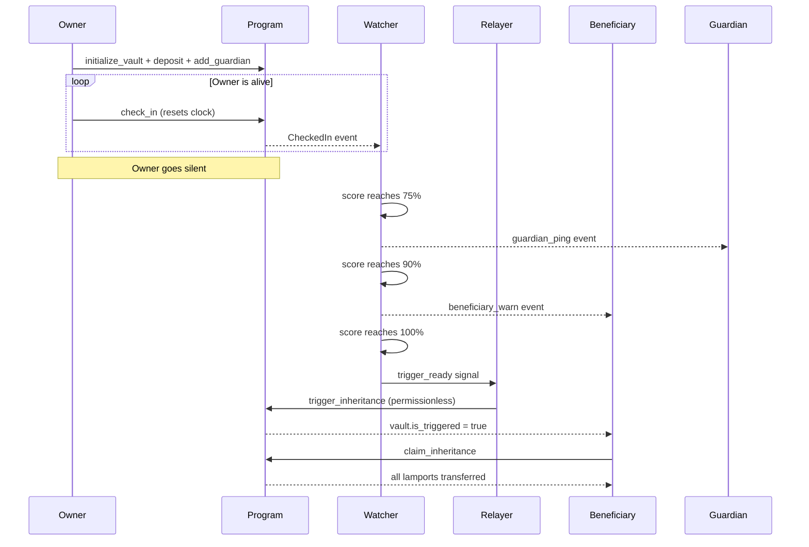

# Legacy Protocol

Legacy Protocol is the inheritance and emergency recovery layer for Solana. It enables any wallet to name a beneficiary, configure an inactivity threshold, deposit SOL, and guarantee that funds reach the beneficiary automatically when the owner goes silent — without a lawyer, probate, or trusted intermediary. The on-chain program is the sole authority over vault funds; no server, team, or individual key can override it.

## How It Works

```
┌─────────────────────────────────────────────────────────────────────────────┐
│ 1. SETUP           │ 2. LIVE              │ 3. INHERITANCE                  │
│                    │                      │                                  │
│  Owner creates     │  Owner checks in     │  Threshold crossed →             │
│  vault, names      │  periodically. Every │  anyone calls                    │
│  beneficiary,      │  on-chain action     │  trigger_inheritance →           │
│  sets threshold,   │  resets the clock.   │  beneficiary calls               │
│  deposits SOL.     │  Watcher monitors.   │  claim_inheritance.              │
└─────────────────────────────────────────────────────────────────────────────┘

```



## Three Security Layers

| Layer | Component | What It Enforces |
|-------|-----------|-----------------|
| 1 — Program law | Anchor 0.31.1 on-chain program | Account ownership, threshold crossing, beneficiary identity, vault lifecycle transitions |
| 2 — Guardian council | M-of-N GuardianAccount PDAs | Every sensitive change (emergency sweep, beneficiary change, guardian removal) requires M-of-N guardian signatures before execution |
| 3 — Timelocks | CovenantAccount.timelock_slots | BeneficiaryChange requires 432,000 slots (~2 days) after M-of-N; GuardianRemoval via owner requires 216,000 slots (~30 hours); EmergencySweep is immediate |

## Inactivity Score and Zone System

The inactivity score is computed as `(elapsed_slots × 100) / threshold_slots` using integer arithmetic.

| Zone | Score Range | Color | Watcher Action |
|------|-------------|-------|----------------|
| Green | 0–74 | 🟢 | Silent monitoring |
| Yellow | 75–89 | 🟡 | Guardian ping emitted |
| Orange | 90–99 | 🟠 | Beneficiary warning emitted |
| Red | ≥ 100 | 🔴 | Trigger signal sent to relayer |

## Quick Start

```bash
npm install @legacy-protocol/sdk
```

```typescript
import {
  deriveVaultPda,
  deriveActivityPda,
  buildInitializeVaultIx,
  buildAddGuardianIx,
  buildCheckInIx,
  sendAndConfirmLegacyTx,
} from "@legacy-protocol/sdk";
import { PublicKey } from "@solana/web3.js";

const PROGRAM_ID = new PublicKey("7h9BH7d9aHGuPubFc6s9GCYDwtWrFNGB8kKKKV8YaSAe");

// 1. Initialize vault
const [vaultPda] = deriveVaultPda(PROGRAM_ID, owner.publicKey, 0n);
const [activityPda] = deriveActivityPda(PROGRAM_ID, vaultPda);

const initIx = buildInitializeVaultIx({
  programId: PROGRAM_ID,
  owner: owner.publicKey,
  beneficiary: beneficiaryPubkey,
  vaultIndex: 0n,
  inactivityThresholdSlots: 5_000_000n, // ~29 days
});
await sendAndConfirmLegacyTx(connection, walletAdapter, [initIx]);

// 2. Add guardian
const addGuardianIx = buildAddGuardianIx({
  programId: PROGRAM_ID,
  owner: owner.publicKey,
  vaultPda,
  guardian: guardianPubkey,
  mOfNThreshold: 1,
});
await sendAndConfirmLegacyTx(connection, walletAdapter, [addGuardianIx]);

// 3. Check in
const [actPda] = deriveActivityPda(PROGRAM_ID, vaultPda);
const checkInIx = buildCheckInIx({
  programId: PROGRAM_ID,
  owner: owner.publicKey,
  vaultPda,
  activityPda: actPda,
});
await sendAndConfirmLegacyTx(connection, walletAdapter, [checkInIx]);
```

## Component Map

| Component | Purpose | Location |
|-----------|---------|----------|
| `programs/legacy_vault` | Anchor 0.31.1 on-chain program, 15 instructions | Rust |
| `crates/shamir` | GF(256) Shamir Secret Sharing crate | Rust |
| `watcher` | Geyser gRPC stream, poll pipeline, alert buses | TypeScript/Node.js |
| `relayer` | trigger_inheritance transaction submission with retry | TypeScript/Node.js |
| `sdk` | Instruction builders, PDA helpers, account fetchers, event parsers, Shamir | TypeScript |
| `app` | Next.js frontend: owner, beneficiary, guardian UIs; Blink Actions endpoints | TypeScript/React |

## Documentation

- [ARCHITECTURE.md](docs/ARCHITECTURE.md) — System architecture with component diagrams
- [PROGRAM.md](docs/PROGRAM.md) — On-chain program reference: accounts, instructions, errors, events
- [SDK.md](docs/SDK.md) — TypeScript SDK integration guide
- [WATCHER.md](docs/WATCHER.md) — Watcher service reference
- [RELAYER.md](docs/RELAYER.md) — Relayer service reference
- [MATH.md](docs/MATH.md) — Mathematical reference with worked examples and test vectors
- [SECURITY.md](docs/SECURITY.md) — Security model, threat model, known limitations
- [DEPLOYMENT.md](docs/DEPLOYMENT.md) — Build, deploy, configure, monitor
- [GUARDIAN_GUIDE.md](docs/GUARDIAN_GUIDE.md) — Guide for guardians
- [OWNER_GUIDE.md](docs/OWNER_GUIDE.md) — Guide for vault owners
- [BENEFICIARY_GUIDE.md](docs/BENEFICIARY_GUIDE.md) — Guide for beneficiaries
- [ERRORS.md](docs/ERRORS.md) — All 30 error codes
- [EVENTS.md](docs/EVENTS.md) — All 17 events
- [CHANGELOG.md](docs/CHANGELOG.md) — Version history and decisions

