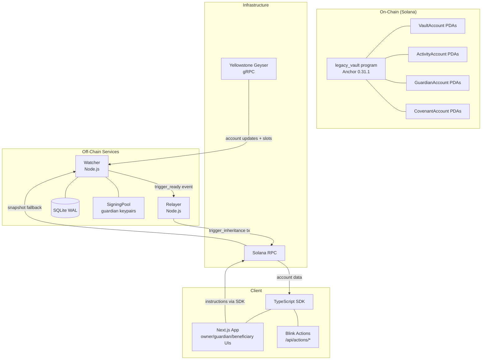
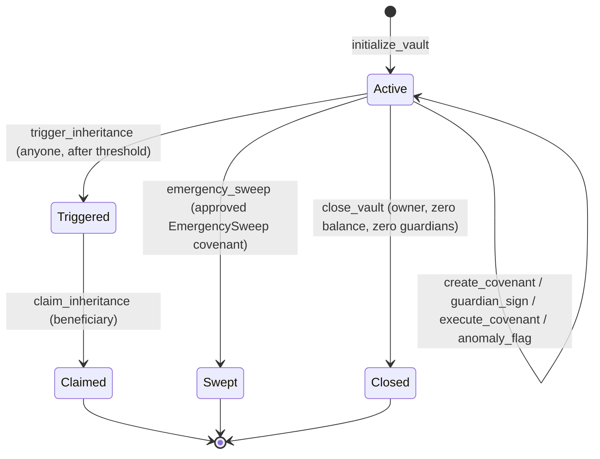

# Architecture

## System Overview



## On-Chain Program

### Account Model

Every account is a PDA owned by the legacy_vault program. No externally owned account can write to these accounts.

**VaultAccount** — 128 bytes (8 disc + 120 data):
```
[8]   discriminator = sha256("account:VaultAccount")[0..8]
[32]  owner: Pubkey
[32]  beneficiary: Pubkey
[1]   guardian_count: u8
[1]   m_of_n_threshold: u8
[8]   inactivity_threshold_slots: u64 (LE)
[8]   last_check_in_slot: u64 (LE)
[8]   created_slot: u64 (LE)
[8]   deposited_lamports: u64 (LE)
[8]   covenant_counter: u64 (LE)
[8]   vault_index: u64 (LE)
[1]   is_triggered: bool
[1]   is_claimed: bool
[1]   is_emergency_swept: bool
[1]   warning_75_sent: bool
[1]   warning_90_sent: bool
[1]   bump: u8
```

**ActivityAccount** — 74 bytes:
```
[8]   discriminator = sha256("account:ActivityAccount")[0..8]
[32]  vault: Pubkey
[8]   checkin_count: u64 (LE)
[8]   sum_of_intervals: u64 (LE)
[8]   last_interval: u64 (LE)
[1]   anomaly_flagged: bool
[8]   anomaly_flagged_slot: u64 (LE)
[1]   bump: u8
```

**GuardianAccount** — 90 bytes:
```
[8]   discriminator = sha256("account:GuardianAccount")[0..8]
[32]  vault: Pubkey
[32]  guardian: Pubkey
[1]   is_active: bool
[8]   added_slot: u64 (LE)
[8]   removal_requested_slot: u64 (LE)   (0 = no pending removal)
[1]   bump: u8
```

**CovenantAccount** — 432 bytes:
```
[8]   discriminator = sha256("account:CovenantAccount")[0..8]
[32]  vault: Pubkey
[1]   covenant_type: enum u8  (0=EmergencySweep, 1=BeneficiaryChange, 2=GuardianRemoval)
[32]  target: Pubkey          (unused for EmergencySweep)
[4]   signers length: u32 (LE)
[320] signers: [Pubkey; 10]   (4-byte length prefix + 32 bytes × 10)
[1]   required_signatures: u8
[8]   created_slot: u64 (LE)
[8]   timelock_slots: u64 (LE)
[8]   signatures_complete_slot: u64 (LE)
[8]   covenant_index: u64 (LE)
[1]   is_executed: bool
[1]   bump: u8
```

### PDA Derivation

| Account | Seeds | Notes |
|---------|-------|-------|
| VaultAccount | `["vault", owner_pubkey_bytes, vault_index_le_u64]` | `vault_index` is 8-byte little-endian u64 |
| ActivityAccount | `["activity", vault_pubkey_bytes]` | One per vault |
| GuardianAccount | `["guardian", vault_pubkey_bytes, guardian_pubkey_bytes]` | One per (vault, guardian) pair |
| CovenantAccount | `["covenant", vault_pubkey_bytes, covenant_index_le_u64]` | `covenant_index` is 8-byte little-endian u64 from vault.covenant_counter before increment |

### Instruction Flow



## Watcher Service

### Geyser gRPC Mode

The watcher subscribes to the Yellowstone Geyser gRPC stream. On every (re)connect it first takes a snapshot via `getProgramAccounts` (RPC) to close the gap window between stream termination and resumption, then subscribes to account updates and slot notifications.

```
startGeyserClient()
  │
  ├── snapshotAllProgramAccounts() via RPC
  │     └── handlers.onSnapshotComplete(seenPubkeys)
  │
  └── gRPC stream.subscribe()
        ├── onAccountUpdate(pubkey, data, slot, lamports) → handleAccountUpdate()
        ├── onSlot(slot) → maybeRunHeartbeat()
        └── on error/end/close → exponential backoff + reconnect
```

Backoff: starts at 1,000 ms, doubles each attempt, caps at 30,000 ms. Resets to 1,000 ms after a successful session.

### Poll Cycle Pipeline

One poll cycle executes per heartbeat. Heartbeat interval is adaptive:

| Most urgent zone | Heartbeat interval |
|------------------|--------------------|
| Green / Yellow | HEARTBEAT_SLOTS (default 300, ~2 min) |
| Orange | HEARTBEAT_SLOTS / 3 (default 100, ~50 s) |
| Red | HEARTBEAT_SLOTS / 10 (default 30, ~15 s) |

Within one cycle:

```
reconcileAllVaults()       — fetch on-chain state, upsert DB, deactivate closed vaults
computeAllInactivityStates() — BigInt score + zone for every active vault
evaluateAllAnomalies()     — submit anomaly_flag on-chain for statistically anomalous vaults
sendGuardianPings()        — emit guardian_ping event for Yellow+ vaults (first time only)
sendBeneficiaryWarnings()  — emit beneficiary_warn event for Orange+ vaults (first time only)
signalEligibleTriggers()   — emit trigger_ready to relayer bus for Red vaults (once only)
recordPollCycle()          — write summary to poll_history table
```

### SQLite Schema

**vaults** table:

| Column | Type | Notes |
|--------|------|-------|
| vault_address | TEXT PRIMARY KEY | base58 PDA |
| owner_address | TEXT | base58 |
| beneficiary | TEXT | base58 |
| vault_index | TEXT | u64 as string |
| last_check_in_slot | TEXT | u64 as string |
| inactivity_threshold_slots | TEXT | u64 as string |
| deposited_lamports | TEXT | u64 as string |
| guardian_count | INTEGER | |
| m_of_n_threshold | INTEGER | |
| warning_75_sent | INTEGER | 0/1 boolean |
| warning_90_sent | INTEGER | 0/1 boolean |
| trigger_signalled | INTEGER | 0/1 boolean |
| anomaly_flagged | INTEGER | 0/1 boolean |
| is_active | INTEGER | 0/1 boolean |
| checkin_count | TEXT | u64 as string |
| sum_of_intervals | TEXT | u64 as string |
| last_polled_slot | TEXT | u64 as string |
| created_at | TEXT | datetime('now') format |
| updated_at | TEXT | datetime('now') format |

**poll_history** table:

| Column | Type |
|--------|------|
| id | INTEGER PRIMARY KEY AUTOINCREMENT |
| cycle_slot | TEXT |
| cycle_start_ms | INTEGER |
| cycle_duration_ms | INTEGER |
| total_vaults | INTEGER |
| deactivated | INTEGER |
| guardian_pings | INTEGER |
| beneficiary_warnings | INTEGER |
| trigger_signals | INTEGER |
| anomaly_flags | INTEGER |
| errors | INTEGER |
| created_at | TEXT |

### SigningPool

`SigningPool` holds the guardian keypairs the watcher uses to submit `anomaly_flag` transactions on-chain. These keypairs have zero authority over vault funds — they can only call `anomaly_flag`, which sets a boolean on the ActivityAccount.

The pool is initialised from `GUARDIAN_SECRET_KEYS` (comma-separated base58 secret keys). If no keys are configured, anomaly flagging is disabled and a warning is logged. `getGuardianForVault(vaultAddress)` returns the mapped keypair for a vault, or the first available keypair as a fallback for single-guardian setups.

### Alert Buses

Three `EventEmitter` buses carry events from the watcher core to delivery integrations. All have `setMaxListeners(0)` to accommodate multiple delivery integrations without triggering Node.js's `MaxListenersExceededWarning`.

| Bus | Event | Emitted when |
|-----|-------|-------------|
| `guardianAlertBus` | `guardian_ping` | Vault first crosses 75% threshold |
| `beneficiaryAlertBus` | `beneficiary_warn` | Vault first crosses 90% threshold |
| `triggerSignalBus` | `trigger_ready` | Vault score ≥ 100% (first time) |

The DB flag is written **before** the event is emitted on each bus. This ordering ensures that a crash between the DB write and the emit does not cause a duplicate notification on restart — the flag is already set when the process comes back up.

## Relayer Service

### Operating Modes

**Same-process mode** (`RELAYER_MODE=same-process`): the relayer subscribes directly to the watcher's `triggerSignalBus` EventEmitter. Zero network overhead. Requires both services in the same Node.js process.

**Separate-process mode** (`RELAYER_MODE=separate-process`): the relayer polls the watcher's `GET /vaults` HTTP endpoint at `RELAYER_POLL_MS` intervals. The relayer keypair can be isolated in a separate environment.

### Trigger Flow

```
trigger_ready event received
  │
  ├── Step 0: Ed25519 signature verification (if TRUSTED_TRIGGER_SIGNER_PUBKEY configured)
  │     └── SignatureRejected → escalate immediately, do NOT retry
  │
  ├── Step 1: verifyTriggerPreflight() — fetch vault on-chain, re-run threshold check
  │     ├── AlreadyTriggered / AlreadyClaimed / AlreadySwept / OwnerCheckedIn / VaultGone
  │     │     └── SkippedPreflight — no transaction submitted
  │     └── ReadyToTrigger → continue
  │
  ├── Step 2: Derive vault PDA from ownerAddress + vaultIndex, compare to event.vaultAddress
  │     └── Mismatch → Failed (corrupted event)
  │
  └── Step 3: withRetry() → submitTriggerTransaction()
        ├── Confirmed → job status = CONFIRMED
        ├── Permanent error (VaultAlreadyTriggered etc.) → fast-fail, escalate
        └── Transient error → exponential backoff, up to maxRetries attempts
```

### withRetry Engine

`TRIGGER_RETRY_OPTIONS`: `maxAttempts=10`, `baseDelayMs=2000`, `maxDelayMs=60000`, `maxJitterMs=1000`.

Delay formula: `min(baseDelayMs × 2^(attempt-1), maxDelayMs) + random(0, maxJitterMs)`.

`isSolanaTransientError` returns false (fast-fail) for these patterns: "already triggered for inheritance", "already been claimed", "already been emergency-swept", "inheritance threshold has not been reached", "not enough guardian signatures", "only the vault owner", "only an active guardian", "only the vault beneficiary". All other errors return true (retry).

### Job Map

In-memory `Map<vaultAddress, TriggerJob>`. A vault that arrives as a second trigger signal while its job is `BROADCASTING` or `CONFIRMED` is silently ignored. A vault with status `FAILED`, `SKIPPED`, or `SIGNATURE_REJECTED` is retried on the next signal.

## SDK

The SDK is a pure TypeScript package with no runtime dependencies beyond `@solana/web3.js` and `@coral-xyz/anchor`. It has zero side effects and is safe to import in both Node.js and browser environments.

### Structure

| Module | Contents |
|--------|----------|
| `pda.ts` | `deriveVaultPda`, `deriveActivityPda`, `deriveGuardianPda`, `deriveCovenantPda` |
| `accounts.ts` | `fetchVault`, `fetchActivity`, `fetchGuardian`, `fetchCovenant`, `fetchAllVaultsForOwner`, `fetchAllGuardiansForVault`, `fetchAllCovenantsForVault` |
| `math.ts` | All 5 math functions + constants, exact BigInt parity with Rust |
| `instructions.ts` | All 15 instruction builders |
| `transactions.ts` | `sendAndConfirmLegacyTx`, `withRetry`, `buildUnsignedTransaction`, `deserializeAndSubmitTx` |
| `events.ts` | All 17 event parsers + `parseLegacyEventFromLog`, `parseLegacyEventsFromLogs` |
| `errors.ts` | `decodeLegacyError`, `getAllErrorCodes` |
| `hooks.ts` | React hooks: `useVault`, `useVaultRealtime`, `useGuardians`, `useCovenants`, `useVaultInactivity` |
| `shamir.ts` | `splitSecret`, `reconstructSecret`, `verifyShare`, `encodeShareBase64`, `decodeShareBase64` |
| `blink.ts` | `buildVaultBlinkUrls`, `buildClaimBlinkUrl`, `buildTriggerBlinkUrl`, `buildCheckInBlinkUrl`, `parseLegacyBlinkUrl` |

## Frontend

The Next.js 14.2.5 app exposes three role-specific interfaces and three Solana Actions endpoints.

### Role Separation

| Route | Interface for | Key features |
|-------|--------------|-------------|
| `/vaults` | Owner | Multi-vault portfolio, inactivity ring, check-in, deposit, threshold config, guardian management, Shamir distribution |
| `/guardian` | Guardian | Dashboard of all guarded vaults sorted by urgency, anomaly flagging, covenant creation/signing, emergency sweep wizard |
| `/claim` | Beneficiary | Vault lookup by address, claim triggered vaults |
| `/recovery` | Recovery coordinator | Reconstruct secret from M-of-N Shamir shares, entirely offline |

### Real-Time Subscription

`useVaultRealtime` subscribes to `connection.onAccountChange` for the vault PDA with a 400 ms debounce. Account changes trigger a refresh of vault state, guardian list, and covenant list.

### Blink Actions Endpoints

| Endpoint | Instruction |
|----------|------------|
| `GET/POST /api/actions/checkin?vault=<addr>` | check_in |
| `GET/POST /api/actions/trigger?vault=<addr>` | trigger_inheritance |
| `GET/POST /api/actions/claim?vault=<addr>` | claim_inheritance |

All endpoints return CORS headers (`Access-Control-Allow-Origin: *`) and Solana Actions spec headers (`X-Action-Version: 2.1.3`, `X-Blockchain-Ids: solana:5eykt4UsFv8P8NJdTREpY1vzqKqZKvdp`). POST handlers return base64-encoded unsigned transactions; the wallet signs and submits.

## Shamir's Secret Sharing

The Rust crate (`crates/shamir`) and the TypeScript SDK (`sdk/src/shamir.ts`) implement identical GF(256) Shamir Secret Sharing. They must produce interchangeable shares.

**Field**: GF(2^8) / (x^8 + x^4 + x^3 + x + 1) — the AES-standard irreducible polynomial (0x11b).

**Addition**: XOR. `gf_add(a, b) = a ^ b`.

**Multiplication**: Russian-peasant algorithm. Each bit of `b` examined LSB first; when the bit is set, `a` is XORed into result; after each step, `a` is left-shifted and reduced by XOR with 0x1b if the high bit was set before the shift.

**Inversion**: Fermat's little theorem. `a^{-1} = a^{254}` via fast exponentiation (square-and-multiply with 8-bit exponent 254 = 0b11111110).

**Split**: For each byte of the secret, a degree-(M-1) polynomial with the secret byte as the constant term and M-1 random coefficients. Evaluated at x=1, 2, …, N using Horner's method seeded from 0: `y = 0; for c in coeffs.reversed(): y = y*x + c`.

**Reconstruct**: Lagrange interpolation at x=0. For M shares: `secret = Σ_i y_i × Π_{j≠i} x_j / (x_i - x_j)` in GF(256), where subtraction is XOR.

## Data Flow: Slot → Watcher → Relayer → Beneficiary

```
Solana slot advances
    │
    ├── Geyser slot notification → maybeRunHeartbeat()
    │         │
    │         └── runPollCycle()
    │               │
    │               ├── reconcileAllVaults(): fetch on-chain lastCheckInSlot
    │               ├── computeAllInactivityStates(): score = (elapsed × 100) / threshold
    │               │         └── score ≥ 100 → zone = Red
    │               └── signalEligibleTriggers(): emit trigger_ready on bus
    │
    └── Relayer receives trigger_ready
              │
              ├── verifyTriggerPreflight(): re-read vault, confirm threshold still crossed
              └── program.methods.triggerInheritance().rpc()
                        │
                        └── vault.is_triggered = true
                                  │
                                  └── Beneficiary calls claim_inheritance
                                            │
                                            └── vault + activity accounts closed
                                                      all lamports → beneficiary
```

## Security Model

Layer 1 (program law) protects against: unauthorized fund access, premature trigger, double-claim, lifecycle bypass.

Layer 2 (guardian council) protects against: single-key compromise. A stolen owner key cannot silently redirect funds (beneficiary change requires M-of-N + 2-day timelock). A stolen guardian key cannot act unilaterally (M-of-N required). A stolen owner key cannot strip guardians instantly (30-hour timelock per guardian removal).

Layer 3 (timelocks) protects against: rapid unauthorized covenant execution. BeneficiaryChange: 432,000 slots (~2 days) after M-of-N. GuardianRemoval via owner path: 216,000 slots (~30 hours). EmergencySweep: 0 slots (speed is the design requirement for active hacks).

**Failure modes**:

- Watcher dies: no alerts fire, but trigger_inheritance remains callable by anyone. The vault funds are safe; the beneficiary may not receive automatic notification but can trigger manually.
- Relayer dies: no automatic trigger submission. Anyone can call trigger_inheritance directly via the Blink URL or any Solana wallet.
- Guardian goes inactive: the M-of-N threshold may be unreachable. The owner should maintain M-of-N ≤ guardian_count at all times and replace inactive guardians.
- All guardians compromised: M-of-N colluding guardians can execute an EmergencySweep, draining vault funds to the beneficiary before the inactivity threshold. This is a known limitation — guardian selection is critical.

